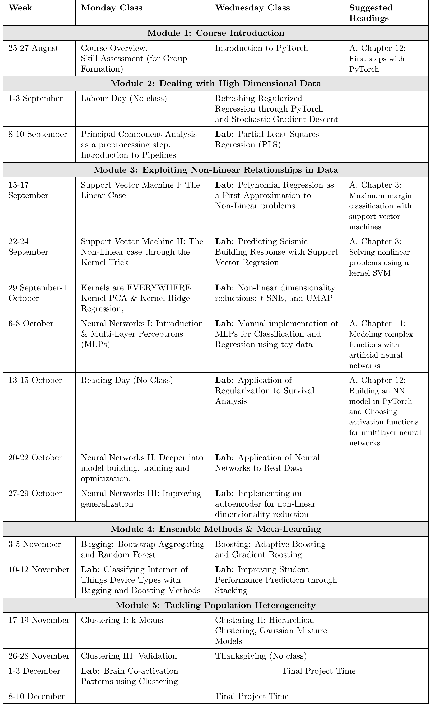

# DS 4021 – Analytics II: Machine Learning

## Materials

* A. [**Python Machine Learning with PyTorch and Scikit-Learn, 4th Edition**](https://sebastianraschka.com/blog/2022/ml-pytorch-book.html) Freely available on O'Reilly with your UVA account.
* B. [**Introduction to statistical learning**](https://www.statlearning.com/) Free PDF.
* C. [**The Elements of Statistical Learning: Data Mining, Inference, and Prediction**](https://hastie.su.domains/ElemStatLearn/) Free PDF.
* D. [**Pattern Recognition and Machine Learning**](https://www.microsoft.com/en-us/research/people/cmbishop/prml-book/) Free PDF.

## Course Schedule

This is the schedule for the core structure of the course. Please be aware that adjustments may occur throughout the semester, as sometimes things do not go exactly as planned. Any changes will be communicated.

